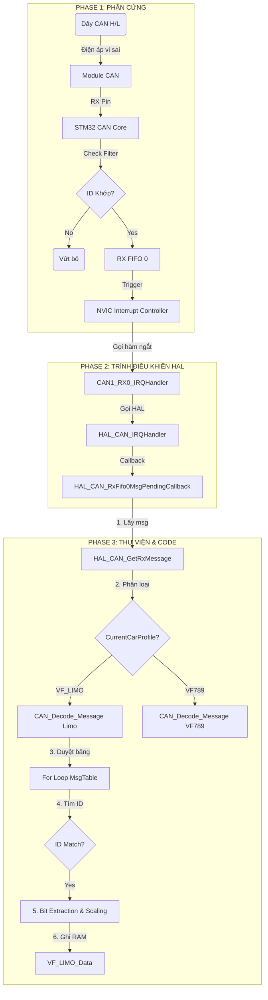

# Sổ Tay Hướng Dẫn Vận Hành & Phát Triển Thư Viện CAN Bus (STM32)

> **Phạm vi tài liệu**: Tài liệu này được thiết kế như một giáo trình chi tiết, dành cho kỹ sư nhúng (Embedded Engineer) từ trình độ cơ bản đến chuyển sâu. Nó giải thích cấu trúc thư viện, nguyên lý hoạt động, cách cấu hình động (Dynamic Profile) và quy trình thêm tính năng mới (như Creep Mode).

---

## MỤC LỤC

1.  [Giới thiệu chung về CAN Bus](#1-giới-thiệu-chung-về-can-bus)
2.  [Kiến trúc Thư Viện (Architecture)](#2-kiến-trúc-thư-viện-architecture)
3.  [Cấu trúc Dữ liệu & Đa cấu hình (Multi-Profile)](#3-cấu-trúc-dữ-liệu--đa-cấu-hình-multi-profile)
4.  [Nguyên lý Hoạt động (Deep Dive)](#4-nguyên-lý-hoạt-động-deep-dive)
    *   [Cơ chế Ngắt (Interrupt)](#cơ-chế-ngắt-interrupt)
    *   [Giải mã Bit (Bit Extraction)](#giải-mã-bit-bit-extraction)
5.  [Hướng dẫn Tích hợp vào Project](#5-hướng-dẫn-tích-hợp-vào-project)
6.  [Hướng dẫn Thực chiến: Thêm tính năng Creep Mode](#6-hướng-dẫn-thực-chiến-thêm-tính-năng-creep-mode)
7.  [Ví dụ Logic Điều khiển (Code Snippets)](#7-ví-dụ-logic-điều-khiển-code-snippets)
8.  [Troubleshooting](#8-troubleshooting)

---

## 1. Giới thiệu chung về CAN Bus

**CAN (Controller Area Network)** là chuẩn giao tiếp xương sống của ô tô.
*   **Đặc điểm**: Chỉ dùng 2 dây (`CAN_H`, `CAN_L`) vi sai, chống nhiễu cực tốt.
*   **Frame**: Mỗi gói tin có **ID (11-bit)** định danh và **Payload (8-byte)** chứa dữ liệu.
*   **Thách thức**: Dữ liệu nhận được là chuỗi hex thô (VD: `0x05 0xA1...`). Ta cần "phiên dịch" nó thành thông số vật lý (VD: Tốc độ, % Bàn đạp ga, Trạng thái số).

---

## 2. Kiến trúc Thư Viện (Architecture)

Thư viện này được thiết kế theo mô hình **Data-Driven** và hỗ trợ **Dynamic Profiling** (Chuyển đổi dòng xe ngay khi chạy).

### Sơ đồ Khối
```mermaid
graph TD
    Hardware[CAN Transceiver] -->|Raw Signal| STM32[STM32 CAN Controller]
    STM32 -->|RX Interrupt| Callback[HAL_CAN_RxFifo0... in main.c]
    Callback -->|Switch(CurrentCarProfile)| Process{Chọn Profile Xe}
    Process -->|Car: VF_LIMO| DecodeLimo[Dùng bảng VF_LIMO_Msg]
    Process -->|Car: VF789| DecodeVF789[Dùng bảng VF789_Msg]
    DecodeLimo -->|Bit Extraction| StructLimo[VF_LIMO_Data]
    DecodeVF789 -->|Bit Extraction| StructVF789[VF789_Data]
```

---

## 3. Cấu trúc Dữ liệu & Đa cấu hình (Multi-Profile)

### 3.1. Quản lý Đa dòng xe
Thay vì dùng `#define` cứng (chỉ chọn được 1 xe khi biên dịch), thư viện dùng biến `CurrentCarProfile`.

```c
// can_lib.h
typedef enum {
    CAR_VF_LIMO = 0,
    CAR_VF789,
    // Thêm xe mới vào đây
} CarProfile_t;

extern CarProfile_t CurrentCarProfile;
```

Trong `main.c`, bạn có thể đổi xe bằng cách gán `CurrentCarProfile = CAR_VF789;`.

### 3.2. Struct Dữ liệu (`CAN_Data_t`)
Dữ liệu sau giải mã được lưu ở đây. Cấu trúc này dùng chung cho các xe có cùng tập tín hiệu.

```c
typedef struct {
    struct {
        float PedalVal;       // Bàn đạp phanh
        uint8_t SwitchSts;    // Công tắc phanh
    } Brake;
    
    // Tính năng mới thêm
    struct {
        uint8_t Disable_Sts;  // Trạng thái Creep Mode
        uint8_t Flag_FWD;     // Cờ báo tiến
    } CreepMode;
} CAN_Data_t;
```

---

## 4. Nguyên lý Hoạt động (Deep Dive)

### Cơ chế Ngắt (Interrupt)
CPU không cần liên tục hỏi "Có thư không?". Khi có thư, phần cứng gõ cửa (Interrupt), CPU nhảy vào hàm `HAL_CAN_RxFifo0MsgPendingCallback` xử lý ngay lập tức.

### Giải mã Bit (Bit Extraction)
Dữ liệu CAN thường nén chặt. Ví dụ tín hiệu `Creep_Flag_FWD` chỉ chiếm **1 bit** tại vị trí 51.
Thư viện xử lý việc:
1.  Tìm đúng byte chứa bit 51.
2.  Dịch bit (`>>`) và Mask (`& 0x01`) để lấy giá trị 0 hoặc 1.
3.  Xử lý **Big Endian (Motorola)**: Tín hiệu vắt qua nhiều byte theo thứ tự ngược.

---

## 5. Hướng dẫn Tích hợp vào Project

1.  **Chép Thư viện**: Copy `can_lib.c` và `can_lib.h` vào project.
2.  **Include**: Trong `main.c` thêm `#include "can_lib.h"`.
3.  **Khởi tạo**:
    ```c
    /* USER CODE BEGIN 2 */
    CAN_Config_Init(&hcan); // Cấu hình Filter + Start CAN + Bật Ngắt
    
    // Chọn xe mặc định
    CurrentCarProfile = CAR_VF_LIMO; 
    /* USER CODE END 2 */
    ```
4.  **Xử lý Logic**: Viết code trong callback `HAL_CAN_RxFifo0MsgPendingCallback` (đã có sẵn switch/case trong `main.c`).

---

## 6. Hướng dẫn Thực chiến: Thêm tính năng Creep Mode

Đây là quy trình chuẩn (Standard Operating Procedure) để thêm một tính năng mới vào thư viện.

**Tình huống**: Thêm chức năng **Creep Mode** (Chế độ bò).
*   **Input**: Cần đọc tín hiệu `Creep_Disable_Sts` (ID 0x403) và `Creep_Flag_FWD` (ID 0x229).

### Bước 1: Khai báo Tên (Signal Name)
Mở `can_lib.h`, thêm vào `enum SignalName`:
```c
    Creep_Disable_Sts_Sig,
    Creep_Flag_FWD_Sig,
    // ...
```

### Bước 2: Chuẩn bị Kho chứa (Struct)
Mở `can_lib.h`, thêm vào `CAN_Data_t`:
```c
    struct {
        uint8_t Disable_Sts;
        uint8_t Flag_FWD;
    } CreepMode;
```

### Bước 3: Cấu hình Bản đồ (Mapping)
Mở `can_lib.c`, thêm vào bảng `VF_LIMO_Msg` (hoặc `VF789`):
```c
    /* VCU_EDSControl_Front - ID 0x229 */
    { .Name = CreepMode_Msg, .ID = 0x229, .Number_Signal = 1,
      .Signal = { 
          { .name = Creep_Flag_FWD_Sig, .start_bit = 51, .length = 1, .endian = CAN_MOTOROLA, ... }
      } 
    },
```

### Bước 4: Viết logic Giải mã
Mở `can_lib.c`, hàm `CAN_Decode_Message`, thêm case:
```c
    case Creep_Flag_FWD_Sig:    
        Data->CreepMode.Flag_FWD = (uint8_t)phys_val; 
        break;
```

---

## 7. Ví dụ Logic Điều khiển (Code Snippets)

### Level 0: Debug thô (Mới bắt đầu)
Chưa biết gì cả? In hết ra xem có gì chạy không.
```c
printf("ID: %X | Data: %02X %02X...\n", RxHeader.StdId, RxData[0], RxData[1]);
```

### Level 1: Đọc trạng thái đơn giản
Kiểm tra xem Creep Mode có bị tắt không.
```c
// Ví dụ với VF_LIMO_Data
if (VF_LIMO_Data.CreepMode.Disable_Sts == 1) {
    // Đã tắt Creep -> Ko cho xe bò
}
```

### Level 2: Xử lý đa dòng xe (Dynamic Profile)
Viết code chạy được cho cả 2 loại xe mà không cần nạp lại firmware.
```c
// main.c
switch (CurrentCarProfile) {
    case CAR_VF_LIMO:
        // Logic riêng cho Limo
        if (VF_LIMO_Data.CreepMode.Disable_Sts == 0) Process_Limo_Creep();
        break;
    case CAR_VF789:
        // Logic riêng cho VF789
        if (VF789_Data.CreepMode.Mode_Req == 1) Process_VF789_Creep();
        break;
}
```

---

## 8. Troubleshooting

| Vấn đề | Nguyên nhân | Cách xử lý |
| :--- | :--- | :--- |
| **Biến data toàn số 0** | Sai Baudrate hoặc thiếu trở 120R | Kiểm tra `hcan.Init.Prescaler` trong CubeMX. Đo trở đầu cuối. |
| **Giá trị cực lớn/nhỏ vô lý** | Sai Endianness | Đổi `CAN_MOTOROLA` thành `CAN_INTEL` (hoặc ngược lại). |
| **Biến nhảy giá trị loạn xạ** | Sai Start Bit | Kiểm tra kỹ lại tài liệu DBC. **StartBit trong code là MSB (với Motorola)**. |
| **Code không chạy vào ngắt** | Quên bật ngắt | Kiểm tra đã gọi `CAN_Config_Init` hoặc `HAL_CAN_ActivateNotification` chưa. |

---

---

## 9. Phân Tích Chi Tiết Các Hàm HAL CAN (HAL Deep Dive)

Đây là "vũ khí" chính của bạn. Hiểu rõ từng biến đầu vào/ra giúp bạn tránh 90% lỗi ngớ ngẩn.

### 9.1. `HAL_CAN_Start`
*   **Tác dụng**: Chuyển trạng thái bộ CAN Controller từ `Initialization Mode` (chỉ cấu hình, không chạy) sang `Normal Mode` (tham gia mạng, có thể gửi/nhận).
*   **Cú pháp**: `HAL_StatusTypeDef HAL_CAN_Start(CAN_HandleTypeDef *hcan)`
*   **Phân tích Tham số**:
    *   `hcan`: Con trỏ đến struct quản lý CAN (thường là `&hcan1` hoặc `&hcan`). Struct này chứa địa chỉ thanh ghi phần cứng.
*   **Lỗi thường gặp**: Quên gọi hàm này -> CAN mãi mãi im lặng.

### 9.2. `HAL_CAN_ActivateNotification`
*   **Tác dụng**: Đăng ký với CPU: "Khi có sự kiện X xảy ra, hãy gọi hàm ngắt (Callback) cho tôi".
*   **Cú pháp**: `HAL_StatusTypeDef HAL_CAN_ActivateNotification(CAN_HandleTypeDef *hcan, uint32_t ActiveITs)`
*   **Phân tích Tham số**:
    *   `ActiveITs`: Là **Mặt nạ Bit (Bitmask)** các sự kiện muốn bắt.
        *   `CAN_IT_RX_FIFO0_MSG_PENDING`: Có thư mới trong hòm thư 0. (Hay dùng nhất).
        *   `CAN_IT_TX_MAILBOX_EMPTY`: Đã gửi thư xong.
        *   `CAN_IT_ERROR`: Có lỗi đường truyền (Bus Off...).
*   **Ví dụ**: `HAL_CAN_ActivateNotification(&hcan, CAN_IT_RX_FIFO0_MSG_PENDING | CAN_IT_ERROR);`

### 9.3. `HAL_CAN_GetRxMessage`
*   **Tác dụng**: Lấy gói tin ra khỏi phần cứng (FIFO) và copy vào RAM để xử lý. **Hàm này giải phóng chỗ trống trong FIFO**.
*   **Cú pháp**: 
    ```c
    HAL_StatusTypeDef HAL_CAN_GetRxMessage(
        CAN_HandleTypeDef *hcan,
        uint32_t RxFifo,
        CAN_RxHeaderTypeDef *pHeader,
        uint8_t aData[])
    ```
*   **Phân tích Tham số**:
    *   `RxFifo`: Chọn hòm thư nào? (`CAN_RX_FIFO0` hoặc `FIFO1`). Phải khớp với cấu hình Filter.
    *   `pHeader` (Output): Con trỏ struct để nhận thông tin tiêu đề (ID, DLC, Timestamp...).
        *   `pHeader->StdId`: ID chuẩn (11-bit). Đây là cái ta cần check (VD: 0x109).
        *   `pHeader->DLC`: Độ dài dữ liệu (0-8).
    *   `aData` (Output): Mảng `uint8_t[8]`. Dữ liệu thô sẽ chép vào đây.
*   **Lưu ý**: Phải gọi hàm này trong ngắt, nếu không FIFO sẽ đầy và CAN bị kẹt (Overrun).

---

## 10. Ví Dụ: Từ "Con Số 0" đến "Chuyên Gia"

### Level 0: "Mò kim đáy bể" (Blind Monitoring)
**Tình huống**: Bạn có một thiết bị CAN lạ hoắc. Không tài liệu, không DBC. Bạn muốn biết nó có sống không?
**Cách làm**: In toàn bộ những gì nhận được lên màn hình.

```c
/* Trong file main.c */
void HAL_CAN_RxFifo0MsgPendingCallback(CAN_HandleTypeDef *hcan)
{
    CAN_RxHeaderTypeDef RxHeader;
    uint8_t RxData[8];

    // 1. Lấy dữ liệu ra
    HAL_CAN_GetRxMessage(hcan, CAN_RX_FIFO0, &RxHeader, RxData);

    // 2. In ra UART (giả sử đã redirect printf)
    // ID: 123 | DLC: 8 | Data: AA BB CC...
    printf("ID: 0x%03X | DLC: %d | Data: ", RxHeader.StdId, RxHeader.DLC);
    
    for(int i=0; i < RxHeader.DLC; i++)
    {
        printf("%02X ", RxData[i]); // In từng byte hex
    }
    printf("\n");
}
```
*Kết quả*: Bạn sẽ thấy màn hình chạy chữ liên tục. Từ đó bạn phát hiện ra "À, ID `0x109` thay đổi khi mình đạp phanh!".

### Level 1: "Bắt đúng kẻ tình nghi" (Filtering Logic)
**Tình huống**: Bạn biết ID phanh là `0x109`. Bạn chỉ quan tâm đến nó. (Chưa dùng thư viện decode).
**Cách làm**: Thêm `if` để lọc ID.

```c
void HAL_CAN_RxFifo0MsgPendingCallback(CAN_HandleTypeDef *hcan)
{
    // ... GetRxMessage ...

    // Chỉ xử lý ID 0x109
    if (RxHeader.StdId == 0x109)
    {
         // Giả sử ta mò được byte số 2 là trạng thái phanh
         uint8_t brake_status = RxData[2]; 
         
         if (brake_status == 0x01) {
             HAL_GPIO_WritePin(LED_PORT, LED_PIN, 1); // Đạp phanh -> Sáng đèn
         } else {
             HAL_GPIO_WritePin(LED_PORT, LED_PIN, 0);
         }
    }
}
```

### Level 2: "Chuyên nghiệp hóa" (Using Library)
**Tình huống**: Xe có hàng trăm tín hiệu. Không thể dùng `if` thủ công mãi được.
**Cách làm**: Dùng thư viện `can_lib` tự động.

```c
/* Trong ngắt */
void HAL_CAN_RxFifo0MsgPendingCallback(CAN_HandleTypeDef *hcan)
{
    /* Code chuẩn của thư viện */
    if (HAL_CAN_GetRxMessage(hcan, CAN_RX_FIFO0, &RxHeader, RxData) == HAL_OK)
    {
         // Tự động phân loại xe và decode vào struct
         CAN_Process_Rx(RxHeader.StdId, RxData);
    }
}

/* Trong Main Loop (while 1) */
while (1)
{
    // Code siêu sạch, dễ đọc như văn xuôi
    if (VF_LIMO_Data.Brake.PedalVal > 20.0f) // Nếu phanh > 20%
    {
         // Do something...
    }
}
```

---

---

## 11. Giải Phẫu Cấu Hình Bộ Lọc (Filter Deep Dive)

Đây là phần phức tạp nhất của khởi tạo CAN. Nếu cấu hình sai, MCU sẽ "bịt tai", không nghe thấy gì cả.

Struct: `CAN_FilterTypeDef`

### 11.1. Chế độ (FilterMode)
*   **`CAN_FILTERMODE_IDMASK` (Mặt nạ)**:
    *   Dùng cặp **ID** và **Mask**.
    *   **Mask** quy định bit nào "quan trọng". Bit 1 là bắt buộc khớp, Bit 0 là "sao cũng được" (Don't care).
    *   *Ví dụ*: Muốn nhận tất cả ID bắt đầu bằng 0x1.. -> Mask = 0xF00, ID = 0x100.
*   **`CAN_FILTERMODE_IDLIST` (Danh sách)**:
    *   Liệt kê chính xác ID muốn nhận. (VD: Chỉ nhận 0x109 và 0x200).
    *   Nghiêm ngặt nhưng số lượng hạn chế.

### 11.2. Thanh ghi (IdHigh, IdLow...)
Tại sao lại có High/Low? Vì thanh ghi phần cứng là 32-bit, nhưng ID chuẩn chỉ 11-bit (hoặc Extended 29-bit).

**Cấu hình "Mở toang cửa" (Accept All) - Khuyên dùng bước đầu**:
```c
canfilter.FilterIdHigh = 0;
canfilter.FilterIdLow  = 0;
canfilter.FilterMaskIdHigh = 0; // Mask = 0 -> Bit nào cũng Match -> Nhận hết
canfilter.FilterMaskIdLow  = 0;
```

**Cấu hình "Chỉ nhận ID 0x123" (Scale 32-bit, Mode Mask)**:
*   ID (11 bit) phải dịch trái 5 bit để khớp với khung thanh ghi STM32 (Mapping: STID[10:0] nằm ở bit [31:21]).
*   `FilterIdHigh = (0x123 << 5) >> 16;` (Lấy 16 bit cao)
*   `FilterIdLow  = (0x123 << 5) & 0xFFFF;` (Lấy 16 bit thấp)
*   `FilterMaskIdHigh = (0x7FF << 5) >> 16;` (Mask chặt 11 bit ID)
*   `FilterMaskIdLow  = (0x7FF << 5) & 0xFFFF;`

---

## 12. Toán Học Đằng Sau Việc Giải Mã (Bitwise Operation)

Hãy mổ xẻ dòng code "thần thánh" trong hàm `CAN_Decode_Message`:

```c
if ((RxData[byte_idx] >> bit_idx) & 0x01)
{
    raw_val |= (1ULL << (sig->length - 1 - bit));
}
```

**Ví dụ thực tế**:
Can ID 0x109 gửi byte: `0b10010110` (Hex: 0x96).
Ta cần lấy **Bit số 4**.

1.  **`RxData[byte_idx]`**: Lấy giá trị byte, ví dụ `10010110`.
2.  **`>> bit_idx`**: Dịch phải 4 lần.
    *   `10010110` >> 4 = `00001001`.
    *   Bit cần lấy (số 4) giờ đã nằm ở vị trí tận cùng bên phải (LSB).
3.  **`& 0x01`**: Phép VÀ với `00000001`.
    *   `00001001` & `00000001` = `00000001` (Kết quả là 1).
    *   Mục đích: Xóa sạch các bit rác bên trái, chỉ giữ lại bit ta vừa dịch xuống.
4.  **`raw_val |= (1ULL << target_pos)`**: Xếp bit này vào đúng chỗ trong biến kết quả.
    *   Nếu ta đang ghép một biến 16-bit, và đây là bit cao nhất (MSB), ta dịch nó sang trái 15 lần rồi OR vào `raw_val`.

**Tóm lại**:
*   `>>` và `&` dùng để **trích xuất** 1 bit từ chuỗi hỗn độn.
*   `<<` và `|` dùng để **xếp hình** bit đó vào vị trí mới ngăn nắp.

---

---

## 13. Vòng Đời Hoạt Động Của Một Hệ Thống CAN (Từ A đến Z)

Phần này trả lời câu hỏi: **"Hàm nào chạy trước, hàm nào chạy sau?"**

### Giai đoạn 1: Khởi động (Initialization) - Chạy 1 lần duy nhất
1.  **System Reset**: Cấp điện, code chạy từ `main()`.
2.  **HAL_Init()**: Khởi tạo thư viện HAL (Systick, NVIC...).
3.  **SystemClock_Config()**: Cấp xung nhịp (VD 72MHz).
4.  **MX_GPIO_Init()**: Cấp điện cho các chân IO.
5.  **MX_CAN_Init()**: (Do CubeMX sinh ra)
    *   Cấp Clock cho bộ CAN.
    *   Cấu hình chân PA11/PA12 (hoặc PB8/PB9) làm chân CAN.
    *   Cấu hình tốc độ (Baudrate) qua Prescaler/BS1/BS2.
    *   *Lúc này CAN đang ở trạng thái ngủ (Sleep/Init).*
6.  **CAN_Config_Init()**: (Hàm của bạn - trong `can_lib.c`)
    *   `HAL_CAN_ConfigFilter()`: Mở "cổng bảo vệ" cho phép ID nào đi qua.
    *   `HAL_CAN_Start()`: **QUAN TRỌNG NHẤT**. Đánh thức CAN, chuyển sang *Normal Mode*.
    *   `HAL_CAN_ActivateNotification()`: Bật loa (Ngắt) để báo khi có thư.

### Giai đoạn 2: Vòng lặp chính (Normal Operation)
Code đi vào `while(1)`. Tại đây CPU rảnh rỗi hoặc làm việc khác (VD: nháy LED, đọc ADC).
CAN Controller (Phần cứng) âm thầm lắng nghe trên dây CAN_H/CAN_L.

### Giai đoạn 3: Khi có tin nhắn đến (Interrupt Event)
1.  **Phần cứng**: Thấy chuỗi bit trên dây hợp lệ -> Nhét vào `FIFO 0`.
2.  **NVIC (Bộ quản lý ngắt)**: Thấy FIFO 0 có hàng -> Gõ vai CPU, bắt tạm dừng `while(1)`.
3.  **CPU**: Nhảy vào hàm `CAN1_RX0_IRQHandler()` (trong `stm32f1xx_it.c`).
4.  **HAL**: Gọi `HAL_CAN_IRQHandler()` -> Gọi `HAL_CAN_RxFifo0MsgPendingCallback()`.
5.  **Callback (Của bạn)**:
    *   Gọi `HAL_CAN_GetRxMessage()`: Lấy dữ liệu ra khỏi hộp thư phần cứng.
    *   Gọi `CAN_Process_Rx()`: Chạy thuật toán giải mã.
    *   Cập nhật biến toàn cục `VF_LIMO_Data`.
6.  **Kết thúc ngắt**: CPU quay lại `while(1)` làm tiếp việc đang dở.

### Giai đoạn 4: Sử dụng dữ liệu
Trong `while(1)`, code của bạn đọc biến `VF_LIMO_Data` (lúc này đã chứa giá trị mới nhất do ngắt cập nhật) để điều khiển xe.

---

## 14. Bộ Sưu Tập Tình Huống (Scenario Collection)

### Case 1: Gửi Dữ Liệu (CAN TX)
Bạn muốn gửi lệnh "Hạ Kính" (Window Down) xuống xe.
*   **ID**: 0x300
*   **Data**: Byte 0 = 0x01 (Down).

```c
void Send_Window_Down_Cmd(CAN_HandleTypeDef *hcan)
{
    CAN_TxHeaderTypeDef TxHeader;
    uint8_t TxData[8] = {0};
    uint32_t TxMailbox;

    // 1. Cấu hình gói tin
    TxHeader.StdId = 0x300;
    TxHeader.RTR = CAN_RTR_DATA; // Khung dữ liệu
    TxHeader.IDE = CAN_ID_STD;   // ID chuẩn (11-bit)
    TxHeader.DLC = 8;            // Gửi đủ 8 byte
    TxHeader.TransmitGlobalTime = DISABLE;

    // 2. Điền dữ liệu
    TxData[0] = 0x01; // Lệnh Down

    // 3. Gửi đi (Bỏ vào hòm thư TX)
    if (HAL_CAN_AddTxMessage(hcan, &TxHeader, TxData, &TxMailbox) != HAL_OK)
    {
        // Gửi lỗi (VD: Mailbox đầy)
        Error_Handler();
    }
}
```

### Case 2: Xử lý khi Bus Off (Mất kết nối)
Nếu dây CAN bị chập hoặc nhiễu quá mạnh, CAN Controller sẽ tự ngắt để bảo vệ (Bus Off). Bạn cần code để tự khôi phục.

```c
// Bật thêm ngắt lỗi trong CAN_Config_Init:
// HAL_CAN_ActivateNotification(..., CAN_IT_RX_FIFO0... | CAN_IT_BUSOFF);

// Hàm Callback xử lý lỗi
void HAL_CAN_ErrorCallback(CAN_HandleTypeDef *hcan)
{
    uint32_t error_code = HAL_CAN_GetError(hcan);
    
    if (error_code & HAL_CAN_ERROR_BOF) // Bus Off
    {
        // Reset lại module CAN để cứu vãn
        HAL_CAN_Stop(hcan);
        HAL_CAN_Start(hcan);
    }
}
```

### Case 3: Quá Tải (FIFO Overrun)
Nếu tin nhắn đến quá nhanh (VD: 1000 msg/s) mà code bạn xử lý chậm, FIFO sẽ bị đầy và tràn (Overrun).
*   **Triệu chứng**: Mất gói tin.
*   **Khắc phục**: 
    1.  Tăng tốc độ xử lý trong ngắt (đừng dùng `HAL_Delay` hay `printf` trong ngắt!).

---

## 15. Sơ Đồ Quy Trình Nhận Tín Hiệu CAN (RX Flowchart)

Dưới đây là sơ đồ chi tiết từng bước, từ khi điện áp xuất hiện trên dây dẫn đến khi biến trong code của bạn thay đổi.

### 15.1. Sơ Đồ Dạng Khối (Mermaid)



### 15.2. Diễn Giải Chi Tiết (Step-by-Step)

#### BƯỚC 1: Lọc Phần Cứng (Hardware Filtering)
*   Gói tin `0x109` đi vào.
*   Bộ lọc hardware (đã setup ở `CAN_Config_Init`) kiểm tra:
    *   Nếu `Mask` cho phép -> Cho qua.
    *   Nếu không -> Vứt ngay lập tức (CPU không hề biết có gói tin này, tiết kiệm tài nguyên).

#### BƯỚC 2: Vào Hàng Đợi (FIFO Pushing)
*   Gói tin được xếp vào ngăn `FIFO 0` (First In, First Out).
*   Nếu FIFO đầy (3 message), gói tin mới sẽ đè gói cũ (nếu cấu hình Overwrite) hoặc bị vứt (nếu cấu hình Locked).

#### BƯỚC 3: Kích Ngắt (Interrupt Trigger)
*   FIFO báo cho NVIC: "Có thư rồi!".
*   NVIC dừng chương trình chính (`main loop`), lưu ngữ cảnh (Context Saving), nhảy sang `IVT` (Vector Table) tìm địa chỉ hàm ngắt.

#### BƯỚC 4: Xử Lý Ngắt (ISR Execution)
*   Tại `HAL_CAN_RxFifo0MsgPendingCallback`:
    *   **Lấy dữ liệu**: `HAL_CAN_GetRxMessage` lấy 8 byte từ thanh ghi phần cứng vào biến RAM tạm `RxData[]`. Việc này cũng giải phóng 1 chỗ trống trong FIFO.
    *   **Gọi giải mã**: Truyền `ID` và `RxData` vào `CAN_Decode_Message`.

#### BƯỚC 5: Giải Mã & Cập Nhật (Decoding)
*   Thư viện "soi" từng bit trong 8 byte `RxData`.
    *   Ví dụ: Tín hiệu `Brake` nằm ở Byte 2, bit 4.
    *   Nó cắt bit đó ra, nhân hệ số `0.1`, cộng `Offset`.
*   Kết quả cuối cùng được ghi đè vào biến toàn cục `VF_LIMO_Data`.

#### BƯỚC 6: Kết Thúc
*   Hàm ngắt thoát (`return`).
*   CPU quay lại `main loop` và tiếp tục chạy. Lúc này nếu code trong `while(1)` đọc `VF_LIMO_Data`, nó sẽ thấy giá trị MỚI NHẤT.

---
*Created by Antigravity Agent, Last Update: 2026-02-09*


                                  